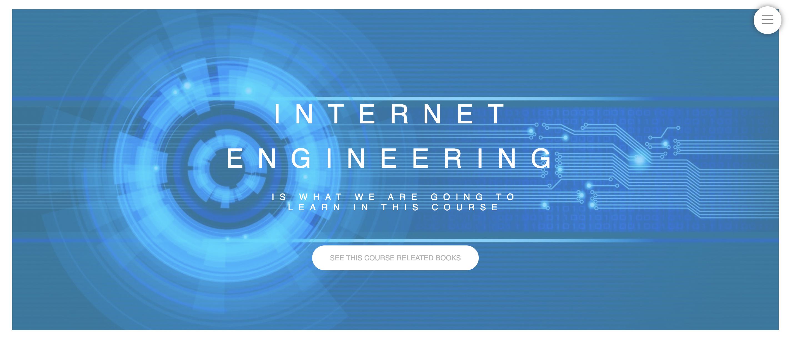

<h1 align="center">
  IE Courses
</h1>

<br />

Second final project of Internet Engineering Course.
Building a **Course Website** template with pure **HTML**, **CSS**, and **JavaScript**.

## Run

Execute the website by clicking on ```index.html```.

## Demo

<p align="center">
  
</p>
